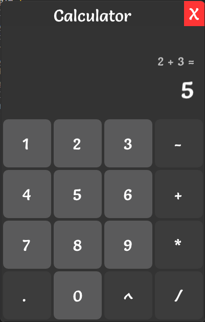

# Desktop Calculator

A Simple Calculator created as a native cross-platform Desktop Application using [GLFW](https://www.glfw.org/) and [ImGui](https://github.com/ocornut/imgui) as Windowing Libraries and used [Vulkan](https://vulkan-tutorial.com/) as a graphics renderer.

---

### Steps to Create Executable
**Requirements** - Vulkan, GCC compiler, Premake

- Clone this Repo with `--recursive` tag to clone all the dependencies.
- Run `scripts/setup.bat`
- Run `scripts/run.bat`

### Future Updates
- [ ] On adding Non-Resizability, Old Titlebar shows up. Fix adding Non-Resizability.
- [ ] Add Responsiveness to the UI.
- [ ] Add a Calculate Button in UI.
- [ ] Add Compatibilty with both keypad keys and board keys.
